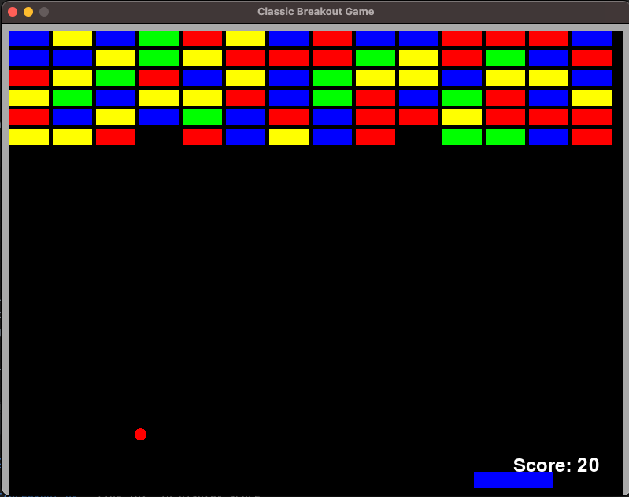
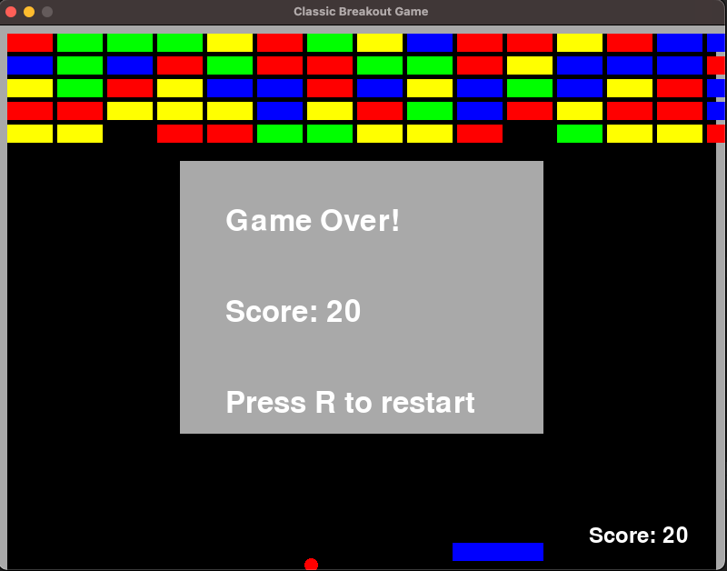
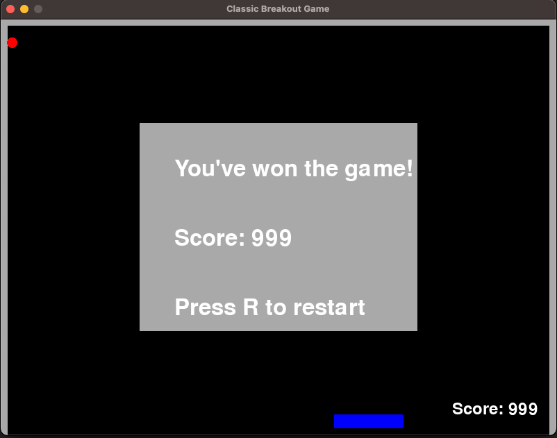

# Classic Breakout Game

This is a classic Breakout game built using Pygame. The game involves breaking bricks with a ball controlled by a paddle. The player uses the paddle to keep the ball in play and destroy all the bricks to win. When the game ends, a popup message displays the final score and prompts the player to restart the game.

## Table of Contents

- [Game Screens](#game-screens)
- [Features](#features)
- [Requirements](#requirements)
- [Installation](#installation)
- [Usage](#usage)
- [Gameplay](#gameplay)

## Game Screens

Game screen:



Game over screen:



Win screen:



## Features

- Player-controlled paddle using keyboard input
- Ball and brick collision detection
- Score tracking and display
- Game over and win messages with a prompt to restart
- Multiple levels with increasing difficulty

## Requirements

- Python 3.6 or later
- Pygame library

## Installation

1. **Clone the repository**:
    ```sh
    git clone https://github.com/yourusername/breakout-game.git
    cd breakout-game
    ```

2. **Set up a virtual environment**:
    ```sh
    python -m venv venv
    ```

3. **Activate the virtual environment**:
    - On Windows:
        ```sh
        venv\Scripts\activate
        ```
    - On macOS and Linux:
        ```sh
        source venv/bin/activate
        ```

4. **Install the required dependencies**:
    ```sh
    pip install -r requirements.txt
    ```

## Usage

1. **Run the game**:
    ```sh
    python breakout.py
    ```

2. **Playing the game**:
    - Use the left and right arrow keys to move the paddle left and right.
    - Keep the ball in play by bouncing it off the paddle.
    - Destroy all the bricks to win the game.
    - When the game ends, a popup message will display the score and prompt you to press 'R' to restart the game.

## Gameplay

- The game screen consists of a paddle, a ball, and multiple rows of bricks.
- Use the left and right arrow keys to move the paddle.
- The ball bounces off the paddle, walls, and bricks.
- When the ball hits a brick, the brick is destroyed, and the score increases.
- The game ends if the ball touches the bottom of the screen.
- If all bricks are destroyed, the player wins, and a popup message displays the score and prompts to restart.
- Press 'R' to restart the game after it ends.
